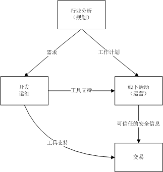
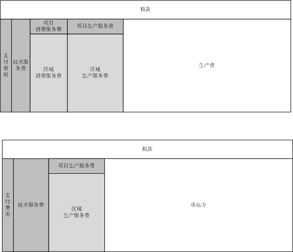

#需求陈述

##背景分析陈述
1. 在您眼中，能有效地向消费者提供安全食品的模式有哪些。
	1. 生产者直销
	2. 农夫市集  
	3. 线上渠道：例如淘宝生态频道、专营电商等。
	4. 线下渠道：例如有机专卖店、超市有机专柜等。  	

2. 有哪些向消费者提供安全食品的模式，是作弊者（试图误导消费者高估食品安全程度）难以模仿的。在您熟悉的业务模式中，诚信经营者与模仿的作弊者之间的竞争情况是怎么样的。 
 
    目前各种模式都缺乏抑制作弊者的手段。作弊者能否生存，不在于是否被识别，而取决于识破者能否有效传播信息。
	1. 生产者直销：生产者发布虚假或模糊的安全信息，模仿安全食品生产者的宣传方案。
	2. 农夫市集：安全信息核实和披露工作不到位，市集组织者仅仅在宣传和摊位布置方面模仿做得较好的市集。 
	3. 线上渠道：先以安全食品打开渠道，之后从常规渠道进货销售，仍模仿安全食品的介绍和定价。
	4. 线下渠道：先以安全食品起步，然后加大提成比例迫使安全食品离场，高利润的不安全食品进入。同时保持在消费者眼中的定位。  

3. 您认为食品安全行业结束高速发展进入稳定期还需要多长时间。您在第一个问题中列出的业务模式，它们在稳定阶段是怎样的情况。如果您认为稳定阶段有多种可能，请尽量描述您认为最好、最坏的几种可能。  
    还需要三年以上。在此之前，行业内呈现多对多的形态--生产者同时向多种渠道供货，消费者同时从多种渠道采购，活跃人士同时参与多个项目。。。
	1. 较坏的可能：作弊的线上渠道实现垄断，控制农夫市集、线下渠道，打压直销模式的生产者，压低农场收购价甚至采购虚假安全食品。使农业人才难以通过生产安全食品健康盈利。消费者即使识破作弊行为，也没有其它途径购买到安全食品。因为没有组织起来，只好各自选购尽可能安全的食品。资本进入作弊的线上渠道后获取暴利，安全退出。
	2. 较好的可能：行业内各种模式组织起来，分别服务于不同层次、不同需要的消费者，并随着消费者的成长而不停改进服务模式。诚信经营的线上、线下渠道持续获得资金和人才。一旦销售虚假安全食品则立即被识破并清理出行业。人才成熟后，先农夫市集、直销生产者转移。  

4. 您认为具体有哪些工作可以避免向较坏的稳定状况发展。（包括其他人提出的较坏可能）
	关键在于作弊行为被识破后，能否广泛传播。如果只有识破者自己拒绝购买，作弊者的损失并不大。消费者之间可信任的传播途径，应具备以下特征：
	1. 传播速度快，范围广。
	2. 信息无需审批，传播难以阻止（包括平台运营方）。
	3. 水军和差评师无法盈利。   

##项目运行陈述
1. 项目的目标：
	1. 在多对多的阶段生存下来。
	2. 提供消费者信任的信息。这种信任来自对项目运行规则的理性分析。
	3. 稳定阶段，可以支撑二十个全职的项目成员。 
2. 运行特征：
	1. 不追求稳定的需求，毫无保留地跟随行业形势持续变化，不停修正与各方的关系，保组持对活跃分子的吸引力。
	2. 可以在零收入的阶段，长期保持项目运行。
	3. 项目组本身无法追求作弊带来的利益。
3. 运行框架：  
    
	1. 行业分析：在项目组以外的开放环境中进行，通过有针对性的交流持续修正对行业形势的判断。并与合作方共享相近的观点和愿景。
	2. 线下活动：运营工作的主要目标是产生可信任的安全判断。产生方式由规划组定义并持续修订。 
	3. 交易：与传统电商的差别。
		* 结构化的安全信息
		* 食品保存的困难（恶意压货、取消订单等问题）
		* 种养殖的风险（不可抗力、调剂等问题）
		* 配送份额（订单-付款单-发货单等问题）
		* 物流（宅配确认、非自有物流的管理）
		* 简化的购物流程
		* 后悔权和清醒期

4. 四层结构：
	 
	项目内主要由指令流、信息流、资金流、物流四个层次。  

	1. 物流：  
		
		* 引入集散点、取菜点。
		* 自动生成配送方案。
	2. 资金流：  
		
		* 技术服务费已通过特别条款锁死。
		* 其它服务费比例，由项目组根据情况调整。
	3. 信息流：  
			
		1. 水军及差评师：无法快速信任，可以快速失去信任。
		2. 开放的信任计算：第三方可以提供收费算法。
	4. 项目组的构成：（<a href="项目介绍及规则.doc">项目规则</a>）
		

5. 项目组内部规则（<a href="项目组成员合同.md">内部合同</a>）
	1. 权力分配：
	2. 利益分配：
	3. 零收入运行模式：
		* 最低20页/季度的开发。
		* 直接兼管两个运营区域。 
	4. 透明度：
		* 开放的行业分析，合作方共享的危机和愿景。
		* 公开的会议、日志、需求。
		* 公开的财务数据。

##具体需求陈述
项目组先讲解项目的线上（流程、界面）、线下（流程、工作表单）具体工作安排。然后，各审议人就以下问题提出意见。预计共60分钟。  

1. 这些需求是否有效支撑上一环节（项目运行）的规划。您有哪些改进的建议。  
2. 根据您或者其他审议人在上一环节（项目运行）的建议，在需求方面您有哪些建议。  

