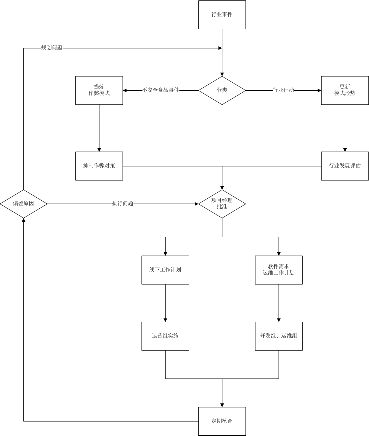

##全局流程

##表单要求
1. 

##行业事件
1. 任何项目成员、会员都可以在项目官网提交行业事件，可以只提供链接，可以指定项目成员分析。默认情况下，随机从规划组成员选择一人分析。
1. 任何项目成员、会员都可以对行业事件作出分析。

##分类、提炼作弊模式、更新行业形势
1. 分析分为两类：
	1. 作弊模式分析：提出食品安全属性被误导而高估的模式。
	2. 模式形势分析：提出行业内各环节的资源、活跃度变化。
1. 只有规划组成员的分析结果可以进入下一环节，其他人的分析结果可以指定一名规划组成员做出评价，默认情况下，随机从规划组成员选择一人负责评价。
1. 规划组成员以外的分析结果，规划组成员应该做出评价。
1. 所有分析结果和评价都可以公开查阅、交流。
1. 规划组成员提交分析结果、做出评价，官方微博发出通告。
2. 对行业事件的分析，要求是48小时内做出，特殊情况应说明理由。

##抑制作弊对策
1. 规划组成员对每一种作弊模式，应提出具体对策。
2. 对策应包括具体实施步骤，陈述完整的进度、预算、预期效果。
3. 对策可以公开查阅。
3. 所有项目成员、会员可以做出评价和建议，这些评价和建议只有项目成员可以查阅。
1. 项目经理应该周期性地组织规划组集体讨论，保持对每种作弊模式都有对策。

##行业发展评估
1. 项目经理应该周期性地组织规划组集体讨论，对上次集体讨论后模式形势分析做出行业发展评估。
2. 行业发展评估应包括以下内容：
	2. 危机：对行业而言最坏的发展可能性。
	3. 愿景：对行业而言现实的、较好的发展可能性。
	4. 发展分析：向危机和愿景发展的关键因素和时间点。
3. 行业发展评估可以公开查阅。

##工作计划的批准、实施
1. 项目经理应定期组织项目会议（规划、开发、运维、运行组成员参与），根据抑制作弊对策和行业发展评估，批准具体工作计划。
2. 线下工作应具体为线下工作计划，由项目运营小组，项目经理批准。
3. 线上工作应具体为软件需求，由开发组提出，项目经理批准。
4. 涉及服务器、网站、微博的工作，由运维组提出运维工作计划，项目经理批准。
4. 批准后的工作计划可以公开查阅。落实到具体个人的任务及工作日志，可以在项目成员个人主页公开查阅。
5. 项目经理对项目成员的工作日志可以做出评价，评价可以公开查阅。
6. 任何项目成员、会员可以对项目成员的工作日志做出评价，只有项目成员可以阅读。

##定期核查
1. 项目经理应定期组织项目核查，检查抑制作弊的效果与预期的偏差。
2. 项目经理应根据偏差项，分为执行原因和规划原因，分别输入到不同环节处理。

##文件模板
1. 《行业事件》
	1. 网页链接：可以不止一个。
	2. 简要说明：提交者编写。
	3. 分析人：可选项，可以选择规划组任何一名成员。
2. 《作弊模式分析》
	1. 《行业事件》：可以不止一个，链接到所分析的行业事件上。
	1. 《作弊模式》：可以不止一个，链接到具体作弊模式上。
	2. 简要说明：分析为何这个事件中隐藏着这些作弊模式。
	3. 评价人：可选项，可以选择规划组任何一名成员。
3. 《作弊模式》
	1. 名称：这种作弊模式的专有名称。
	2. 定义：作弊过程的描述。
	3. 对策：具体的工作步骤，以及效果预期。
4. 《行业发展评估》
	1. 《行业事件》：可以不止一个，链接到所分析的行业事件上。
	2. 所属OG：各OG的发展情况不同步，因为各自独立写。
	2. 各环节发展：从行业事件中，提炼出某个环节的资源、活跃度两项指标的变化。
		1. 环节名称：
		2. 变化维度：资源或活跃度。
		3. 变化：分为--、-、+、++四种。
		4. 简要说明
	3. 综述:综述结束时应明确对项目线下工作、软件需求的影响。
5. 	《行业环节列表》（由规划组公布，《行业发展评估》编写者只能从中选取）
	1. 环节名称：
	2. 简要说明：
6. 	《线下工作计划》
7. 	《软件需求》
8. 	《运维工作计划》