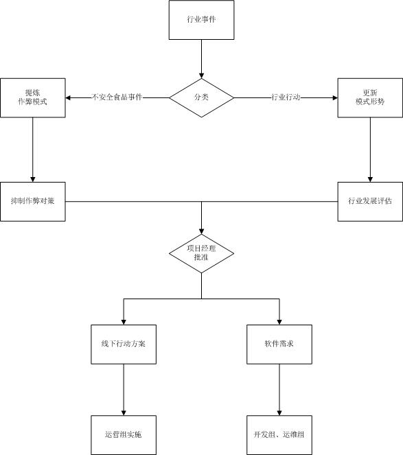

项目模型</img>

##行业事件
1. 任何项目成员、会员都可以在项目官网提交行业事件，可以只提供链接，可以指定项目成员分析。默认情况下，随机从规划组成员选择一人分析。
1. 任何项目成员、会员都可以对行业事件作出分析。

##分类、提炼作弊模式、更新行业形势
1. 分析分为两类：
	1. 作弊模式分析：提出食品安全属性被误导而高估的模式。
	2. 模式形势分析：提出行业内各环节的资源、活跃度变化。
1. 只有规划组成员的分析结果可以进入下一环节，其他人的分析结果可以指定一名规划组成员做出评价，默认情况下，随机从规划组成员选择一人负责评价。
1. 规划组成员以外的分析结果，规划组成员应该做出评价。
1. 所有分析结果和评价都可以公开查阅、交流。
1. 规划组成员提交分析结果、做出评价，官方微博发出通告。

##抑制作弊对策
1. 规划组成员对每一种作弊模式，应提出具体对策。
2. 对策应包括具体实施步骤，陈述完整的进度、预算、预期效果。
3. 所有项目成员、会员可以做出评价和建议，这些评价和建议是可以公开查阅的。